# Jarkom-Modul-3-2025-K10
## Anggota Kelompok 10
| Nama                      | NRP        | Soal  |
| --------------------------| ---------- | ----- |
| Bayu Kurniawan            | 5027241055 | 11-20 |
| Ica Zika Hamizah          | 5027241058 | 1-10  |

## Pembahasan soal
### Nomor 1
Soal:
Di awal Zaman Kedua, setelah kehancuran Beleriand, para Valar menugaskan untuk membangun kembali jaringan komunikasi antar kerajaan. Para Valar menyalakan Minastir, Aldarion, Erendis, Amdir, Palantir, Narvi, Elros, Pharazon, Elendil, Isildur, Anarion, Galadriel, Celeborn, Oropher, Miriel, Amandil, Gilgalad, Celebrimbor, Khamul, dan pastikan setiap node (selain Durin sang penghubung antar dunia) dapat sementara berkomunikasi dengan Valinor/Internet (nameserver 192.168.122.1) untuk menerima instruksi awal.

Penjelasan: Langkah pertama adalah membangun topologi sesuai diagram  dan mengatur konfigurasi jaringan dasar untuk setiap node menggunakan file `/etc/network/interfaces`. Router `Durin` diatur untuk menerima IP dari NAT1 (eth0) dan memiliki IP statis untuk setiap subnet internal (eth1-eth5). Node statis (seperti `Elendil`) diatur dengan IP, gateway, dan DNS sementara (`192.168.122.1`). Node dinamis (seperti `Amandil`) diatur untuk menggunakan DHCP, tetapi tetap diberi DNS sementara agar bisa `apt-get update`.

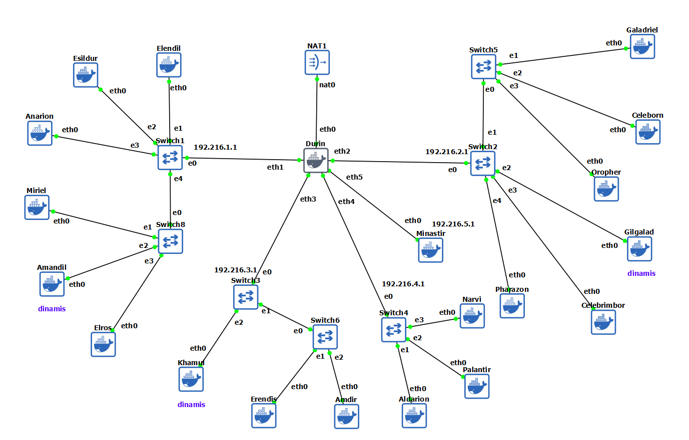

Config setiap node dengan alamat IP, netmask, dan gateway yang sesuai melalui file `/etc/network/interfaces`. Berikut konfigurasi untuk setiap node:

-  Durin (Router/DHCP Relay)
```sh
cat <<EOF > /etc/network/interfaces
# Interface ke NAT1 (Internet)
auto eth0
iface eth0 inet dhcp

# Interface ke Switch1 (Prefix 1.1)
auto eth1
iface eth1 inet static
    address 192.216.1.1
    netmask 255.255.255.0

# Interface ke Switch2 (Prefix 2.1)
auto eth2
iface eth2 inet static
    address 192.216.2.1
    netmask 255.255.255.0

# Interface ke Switch3 (Prefix 3.1)
auto eth3
iface eth3 inet static
    address 192.216.3.1
    netmask 255.255.255.0

# Interface ke Switch6 (Prefix 4.1)
auto eth4
iface eth4 inet static
    address 192.216.4.1
    netmask 255.255.255.0

# Interface ke Switch4 (Prefix 5.1)
auto eth5
iface eth5 inet static
    address 192.216.5.1
    netmask 255.255.255.0
EOF
```

Selain itu, IP forwarding dan NAT dasar diaktifkan di Durin agar node lain bisa terhubung ke internet untuk instalasi awal.

```sh
cat <<EOF > /etc/.bashrc
apt-get update
apt-get install -y iptables
iptables -t nat -A POSTROUTING -o eth0 -j MASQUERADE
EOF
```

####  Subnet 1 (Gateway 192.168.1.1)
```sh
- Elendil (Laravel Worker-1)
cat <<EOF > /etc/network/interfaces
auto eth0
iface eth0 inet static
    address 192.216.1.2
    netmask 255.255.255.0
    gateway 192.216.1.1
    up echo nameserver 192.168.122.1 > /etc/resolv.conf
EOF
```
- Isildur (Laravel Worker-2)
```sh
cat <<EOF > /etc/network/interfaces
auto eth0
iface eth0 inet static
    address 192.216.1.3
    netmask 255.255.255.0
    gateway 192.216.1.1
    up echo nameserver 192.168.122.1 > /etc/resolv.conf
EOF
```
- Anarion (Laravel Worker-3)
```sh
cat <<EOF > /etc/network/interfaces
auto eth0
iface eth0 inet static
    address 192.216.1.4
    netmask 255.255.255.0
    gateway 192.216.1.1
    up echo nameserver 192.168.122.1 > /etc/resolv.conf
EOF
```
- Miriel (Client-Static-1)
```sh
cat <<EOF > /etc/network/interfaces
auto eth0
iface eth0 inet static
    address 192.216.1.5
    netmask 255.255.255.0
    gateway 192.216.1.1
    up echo nameserver 192.168.122.1 > /etc/resolv.conf
EOF
```
- Elros (Load Balancer (Laravel))
```sh
cat <<EOF > /etc/network/interfaces
auto eth0
iface eth0 inet static
    address 192.216.1.6
    netmask 255.255.255.0
    gateway 192.216.1.1
    up echo nameserver 192.168.122.1 > /etc/resolv.conf
EOF
```
#### Subnet 2 (Gateway: 192.216.2.1)

- Galadriel (PHP Worker-1)
```sh
cat <<EOF > /etc/network/interfaces
auto eth0
iface eth0 inet static
    address 192.216.2.2
    netmask 255.255.255.0
    gateway 192.216.2.1
    up echo nameserver 192.168.122.1 > /etc/resolv.conf
EOF
```
- Celeborn (PHP Worker-2)
```sh
cat <<EOF > /etc/network/interfaces
auto eth0
iface eth0 inet static
    address 192.216.2.3
    netmask 255.255.255.0
    gateway 192.216.2.1
    up echo nameserver 192.168.122.1 > /etc/resolv.conf
EOF
```
- Oropher (PHP Worker-3)
```sh
cat <<EOF > /etc/network/interfaces
auto eth0
iface eth0 inet static
    address 192.216.2.4
    netmask 255.255.255.0
    gateway 192.216.2.1
    up echo nameserver 192.168.122.1 > /etc/resolv.conf
EOF
```
- Celebrimbor (Client-Static-2)
```sh
cat <<EOF > /etc/network/interfaces
auto eth0
iface eth0 inet static
    address 192.216.2.5
    netmask 255.255.255.0
    gateway 192.216.2.1
    up echo nameserver 192.168.122.1 > /etc/resolv.conf
EOF
```
- Pharazon (Load Balancer (PHP))
```sh
cat <<EOF > /etc/network/interfaces
auto eth0
iface eth0 inet static
    address 192.216.2.6
    netmask 255.255.255.0
    gateway 192.216.2.1
    up echo nameserver 192.168.122.1 > /etc/resolv.conf
EOF
```
#### Subnet 3 (Gateway: 192.216.3.1)

- Erendis (DNS Master)
```sh
cat <<EOF > /etc/network/interfaces
auto eth0
iface eth0 inet static
    address 192.216.3.2
    netmask 255.255.255.0
    gateway 192.216.3.1
    up echo nameserver 192.168.122.1 > /etc/resolv.conf
EOF
```
- Amdir (DNS Slave)
```sh
cat <<EOF > /etc/network/interfaces
auto eth0
iface eth0 inet static
    address 192.216.3.3
    netmask 255.255.255.0
    gateway 192.216.3.1
    up echo nameserver 192.168.122.1 > /etc/resolv.conf
EOF
```
#### Subnet 4 (Gateway: 192.216.4.1)

- Aldarion (DHCP Server)
```sh
cat <<EOF > /etc/network/interfaces
auto eth0
iface eth0 inet static
    address 192.216.4.2
    netmask 255.255.255.0
    gateway 192.216.4.1
    up echo nameserver 192.168.122.1 > /etc/resolv.conf
EOF
```
- Palantir (Database Server)
```sh
cat <<EOF > /etc/network/interfaces
auto eth0
iface eth0 inet static
    address 192.216.4.3
    netmask 255.255.255.0
    gateway 192.216.4.1
    up echo nameserver 192.168.122.1 > /etc/resolv.conf
EOF
```
- Narvi (Database Slave)
```sh
cat <<EOF > /etc/network/interfaces
auto eth0
iface eth0 inet static
    address 192.216.4.4
    netmask 255.255.255.0
    gateway 192.216.4.1
    up echo nameserver 192.168.122.1 > /etc/resolv.conf
EOF
```
#### Subnet 5 (Gateway: 192.216.5.1)

- Minastri (Forward Proxy)
```sh
cat <<EOF > /etc/network/interfaces
auto eth0
iface eth0 inet static
    address 192.216.5.2
    netmask 255.255.255.0
    gateway 192.216.5.1
    up echo nameserver 192.168.122.1 > /etc/resolv.conf
EOF
```
#### Dinamis
- Gilgalad (Client-Dynamic-1)
```sh
cat <<EOF > /etc/network/interfaces
auto eth0
iface eth0 inet dhcp

up echo nameserver 192.168.122.1 > /etc/resolv.conf
EOF
```
- Amandil (Client-Dynamic-2)
```sh
cat <<EOF > /etc/network/interfaces
auto eth0
iface eth0 inet dhcp

up echo nameserver 192.168.122.1 > /etc/resolv.conf
EOF
```
- Khamul (Client-Fixed-Address)
```sh
cat <<EOF > /etc/network/interfaces
auto eth0
iface eth0 inet dhcp

up echo nameserver 192.168.122.1 > /etc/resolv.conf
EOF
```

Verifikasi: Setelah me-restart semua node, jalankan ping 8.8.8.8 atau apt-get update dari salah satu node statis (misal Elendil) untuk memastikan koneksi internet berfungsi.

### Nomor 2
Soal:
Raja Pelaut Aldarion, penguasa wilayah Númenor, memutuskan cara pembagian tanah client secara dinamis. Ia menetapkan:
- Client Dinamis Keluarga Manusia: Mendapatkan tanah di rentang [prefix ip].1.6 - [prefix ip].1.34 dan [prefix ip].1.68 - [prefix ip].1.94.
- Client Dinamis Keluarga Peri: Mendapatkan tanah di rentang [prefix ip].2.35 - [prefix ip].2.67 dan [prefix ip].2.96 - [prefix ip].2.121.
- Khamul yang misterius: Diberikan tanah tetap di [prefix ip].3.95, agar keberadaannya selalu diketahui. Pastikan Durin dapat menyampaikan dekrit ini ke semua wilayah yang terhubung dengannya.


Penjelasan: Soal ini meminta kita mengkonfigurasi DHCP Server dan DHCP Relay.

- `Aldarion` (`192.216.4.2`) akan diinstal `isc-dhcp-server` dan dikonfigurasi di `/etc/dhcp/dhcpd.conf` untuk menyediakan rentang IP yang diminta.

- `Durin` akan diinstal `isc-dhcp-relay` untuk meneruskan permintaan DHCP dari Subnet 1, 2, dan 3 ke server `Aldarion` di Subnet 4.

Konfigurasi `Aldarion` (DHCP Server):
Pertama install `isc-dhcp-server`, masukkan config berikut dan start `isc-dhcp-server`.

```sh
cat <<EOF > /etc/dhcp/dhcpd.conf

ddns-update-style none;
authoritative;
log-facility local7;

default-lease-time 600;
max-lease-time 7200;

# --- Subnet 1: Keluarga Manusia (Amandil) ---
subnet 192.216.1.0 netmask 255.255.255.0 {
    range 192.216.1.6 192.216.1.34; # ke dobel sama ip-nya elros(1.6)
    range 192.216.1.68 192.216.1.94;
    option routers 192.216.1.1;
    option broadcast-address 192.216.1.255;
    option domain-name-servers 192.216.3.2, 192.216.3.3, 192.168.122.1;
}

# --- Subnet 2: Keluarga Peri (Gilgalad) ---
subnet 192.216.2.0 netmask 255.255.255.0 {
    range 192.216.2.35 192.216.2.67;
    range 192.216.2.96 192.216.2.121;
    option routers 192.216.2.1;
    option broadcast-address 192.216.2.255;
    option domain-name-servers 192.216.3.2, 192.216.3.3, 192.168.122.1;
}


# ========================
#  SUBNET 3 - KURCACI khamul
# ========================
subnet 192.216.3.0 netmask 255.255.255.0 {
    option routers 192.216.3.1;
    option broadcast-address 192.216.3.255;
}

# ========================
#  SUBNET 4 - DATABASE
# ========================
subnet 192.216.4.0 netmask 255.255.255.0 {
    option routers 192.216.4.1;
    option broadcast-address 192.216.4.255;
}

# ========================
#  SUBNET 5 - PROXY
# ========================
subnet 192.216.5.0 netmask 255.255.255.0 {
    option routers 192.216.5.1;
    option broadcast-address 192.216.5.255;
}

# --- PERBAIKAN: Subnet 4 (Tempat Aldarion Berada) ---
# Wajib ada agar servis bisa menyala
subnet 192.216.4.0 netmask 255.255.255.0 {
}

host Khamul {
    hardware ethernet 02:42:9c:bc:cc:00;
    fixed-address 192.216.3.95;
}
EOF
```

Konfigurasi `Durin` (DHCP Relay):
Pertama install `isc-dhcp-relay`, masukkan config berikut dan start `isc-dhcp-relay`.

```sh
cat <<EOF > /etc/default/isc-dhcp-relay
SERVERS="192.216.4.2"
INTERFACES="eth1 eth2 eth3 eth4 eth5"
EOF
```

```sh
cat <<EOF > /etc/sysctl.conf
net.ipv4.ip_forward=1
EOF
```

Verifikasi: Jalankan `ip a` untuk memverifikasi bahwa ia mendapat IP di rentang yang benar (misal `192.216.1.7`).

Hasil ip di Amandil


Hasil ip di Gilgalad


Hasil ip di Khamul

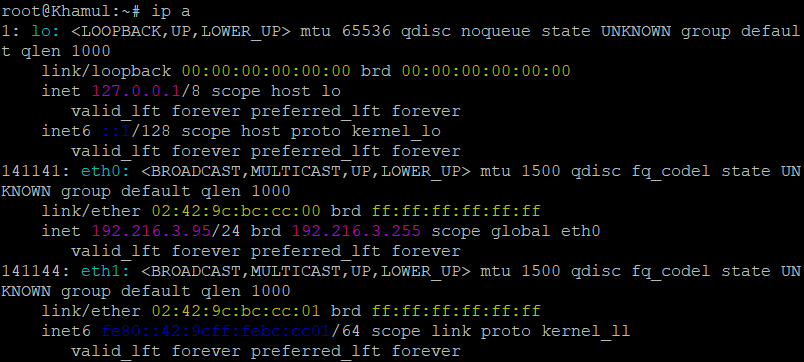

### Nomor 3
Soal:
Untuk mengontrol arus informasi ke dunia luar (Valinor/Internet), sebuah menara pengawas, Minastir didirikan. Minastir mengatur agar semua node (kecuali Durin) hanya dapat mengirim pesan ke luar Arda setelah melewati pemeriksaan di Minastir.

Penjelasan: Soal ini meminta kita mengatur agar hanya `Minastir` yang boleh mengakses DNS internet. `Minastir` (`192.216.5.2`) akan diinstal BIND9 dan dikonfigurasi sebagai Forwarder-Only. Server DNS Internal (`Erendis` & `Amdir`) akan diatur untuk meneruskan query eksternal ke `Minastir`. Terakhir, firewall `Durin` diatur untuk memblokir (`DROP`) semua traffic kecuali yang diizinkan secara eksplisit (termasuk `Minastir` ke internet).

Konfigurasi `Minastir` (DNS Forwarder):
```sh
cat <<EOF > /etc/bind/named.conf.options
options {
    directory "/var/cache/bind";

    # Izinkan query dari semua subnet internal kita
    allow-query { 192.216.0.0/16; };
    
    # Teruskan SEMUA query ke DNS Internet (misal: NAT GNS3)
    forwarders {
        192.168.122.1;
    };
    forward only; # Ini menjadikannya murni forwarder

    dnssec-validation auto;
    listen-on-v6 { any; };
};
EOF
```

### Nomor 4
Soal:
Ratu Erendis, sang pembuat peta, menetapkan nama resmi untuk wilayah utama (<xxxx>.com). Ia menunjuk dirinya (ns1.<xxxx>.com) dan muridnya Amdir (ns2.<xxxx>.com) sebagai penjaga peta resmi. Setiap lokasi penting (Palantir, Elros, Pharazon, Elendil, Isildur, Anarion, Galadriel, Celeborn, Oropher) diberikan nama domain unik yang menunjuk ke lokasi fisik tanah mereka. Pastikan Amdir selalu menyalin peta (master-slave) dari Erendis dengan setia.

Penjelasan: Kita mengkonfigurasi BIND9 di `Erendis` sebagai Master dan di `Amdir` sebagai Slave. Konfigurasi options (dari Soal 3) sudah diatur. Kita hanya perlu menambahkan `named.conf.local` dan file zona (`db.K10.com`) di `Erendis`.

Konfigurasi `Erendis` (DNS Master):
```sh
cat <<EOF > /etc/bind/db.K10.com
; File Zona untuk K10.com
$TTL    604800
@       IN      SOA     ns1.K10.com. root.K10.com. (
                        2         ; Serial (Ubah ini jika Anda mengedit file)
                   604800         ; Refresh
                    86400         ; Retry
                  2419200         ; Expire
                   604800 )       ; Negative Cache TTL
;
; Name Servers
@       IN      NS      ns1.K10.com.
@       IN      NS      ns2.K10.com.

; Alamat IP Name Servers
ns1     IN      A       192.216.3.2     ; IP Erendis
ns2     IN      A       192.216.3.3     ; IP Amdir

; A Records untuk Lokasi Penting (Soal 4)
palantir  IN    A       192.216.4.3
elros     IN    A       192.216.1.6
pharazon  IN    A       192.216.2.6
elendil   IN    A       192.216.1.2
isildur   IN    A       192.216.1.3
anarion   IN    A       192.216.1.4
galadriel IN    A       192.216.2.2
celeborn  IN    A       192.216.2.3
oropher   IN    A       192.216.2.4
EOF
```
```sh
cat <<EOF > /etc/bind/named.conf.local
// Konfigurasi Zona Master
zone "K10.com" {
    type master;
    file "/etc/bind/db.K10.com"; // Path ke file zona
    allow-transfer { 192.216.3.3; };    // Izinkan transfer HANYA ke Amdir
};
EOF
```
```sh
cat <<EOF > /etc/bind/named.conf.options
options {
    directory "/var/cache/bind";
    forwarders {
        192.216.5.2; # <-- Meneruskan ke Minastir
    };
    dnssec-validation auto;
    listen-on-v6 { any; };
};
EOF
```

Konfigurasi `Amdir` (DNS Slave):
```sh
cat <<EOF > /etc/bind/named.conf.options
options {
    directory "/var/cache/bind";
    forwarders {
        192.216.5.2; # <-- Meneruskan ke Minastir
    };
    dnssec-validation auto;
    listen-on-v6 { any; };
};
EOF
```
```sh
cat <<EOF > /etc/bind/named.conf.local
// Konfigurasi Zona Slave
zone "K10.com" {
    type slave;
    file "db.K10.com";          // BIND akan otomatis membuat file ini dari master
    masters { 192.216.3.2; };   // IP Master (Erendis)
};
EOF
```

Verifikasi: Di client (misal `Amandil`), jalankan `dig elros.K10.com`. Hasilnya harus NOERROR dan menunjukkan `ANSWER SECTION` dengan IP `192.216.1.6`.

Hasil
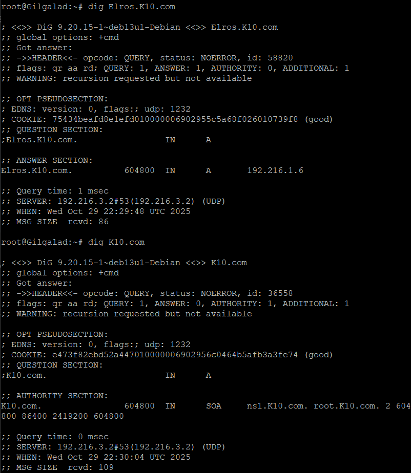

### Nomor 5
Soal:
Untuk memudahkan, nama alias www.<xxxx>.com dibuat untuk peta utama <xxxx>.com. Reverse PTR juga dibuat agar lokasi Erendis dan Amdir dapat dilacak dari alamat fisik tanahnya. Erendis juga menambahkan pesan rahasia (TXT record) pada petanya: "Cincin Sauron" yang menunjuk ke lokasi Elros, dan "Aliansi Terakhir" yang menunjuk ke lokasi Pharazon. Pastikan Amdir juga mengetahui pesan rahasia ini.

Penjelasan: Kita akan mengedit konfigurasi di `Erendis` (Master) untuk menambahkan zona PTR (reverse lookup) untuk subnet `192.216.3.0/24`. Kita juga akan mengedit file `db.K10.com` untuk menambahkan CNAME dan TXT, serta menaikkan nomor serial agar `Amdir` menyalin perubahan.

Konfigurasi `Erendis` (Update):
tambahkan zona reverse
```sh
cat <<EOF > /etc/bind/named.conf.local
// Zona Master (Forward)
zone "K10.com" {
    type master;
    file "/etc/bind/db.K10.com";
    allow-transfer { 192.216.3.3; };
};

// BARU: Zona Reverse PTR untuk 192.216.3.x
zone "3.216.192.in-addr.arpa" {
    type master;
    file "/etc/bind/db.192.216.3";
    allow-transfer { 192.216.3.3; };
};
EOF
```

Buat file zona reverse baru
```sh
cat <<EOF > /etc/bind/db.192.216.3
\$TTL    604800
@       IN      SOA     ns1.K10.com. root.K10.com. (
                        1         ; Serial baru
                   604800         ; Refresh
                    86400         ; Retry
                  2419200         ; Expire
                   604800 )       ; Negative Cache TTL
;
@       IN      NS      ns1.K10.com.
@       IN      NS      ns2.K10.com.

; PTR Records (Soal 5)
2       IN      PTR     ns1.K10.com. ; 192.216.3.2
3       IN      PTR     ns2.K10.com. ; 192.216.3.3
EOF
```

Edit file zona forward LAMA (tambahkan CNAME/TXT)
```sh
cat <<EOF > /etc/bind/db.K10.com
\$TTL    604800
@       IN      SOA     ns1.K10.com. root.K10.com. (
                        3         ; Serial (NAIKKAN DARI 2)
                   604800         ; Refresh
                    86400         ; Retry
                  2419200         ; Expire
                   604800 )       ; Negative Cache TTL
;
; Name Servers (dari Soal 4)
@       IN      NS      ns1.K10.com.
@       IN      NS      ns2.K10.com.
ns1     IN      A       192.216.3.2
ns2     IN      A       192.216.3.3

; A Records (dari Soal 4)
Palantir  IN    A       192.216.4.3
Elros     IN    A       192.216.1.6
Pharazon  IN    A       192.216.2.6
Elendil   IN    A       192.216.1.2
Isildur   IN    A       192.216.1.3
Anarion   IN    A       192.216.1.4
Galadriel IN    A       192.216.2.2
Celeborn  IN    A       192.216.2.3
Oropher   IN    A       192.216.2.4

; --- TAMBAHAN SOAL 5 ---
www       IN      CNAME   elros.K10.com.
@         IN      TXT     "Cincin Sauron menunjuk ke Elros"
@         IN      TXT     "Aliansi Terakhir menunjuk ke Pharazon"
EOF
```

Konfigurasi `Amdir` (Update):
```sh
cat <<EOF > /etc/bind/named.conf.local
// Zona Slave (Forward)
zone "K10.com" {
    type slave;
    file "db.K10.com";
    masters { 192.216.3.2; };
};

// BARU: Zona Reverse PTR untuk 192.216.3.x
zone "3.216.192.in-addr.arpa" {
    type slave;
    file "db.192.216.3";
    masters { 192.216.3.2; };
};
EOF
```

Verifikasi: Di client (misal `Amandil`), jalankan `dig www.K10.com` (cek CNAME), `dig K10.com TXT` (cek TXT), dan `dig -x 192.216.3.2` (cek PTR).

Hasil
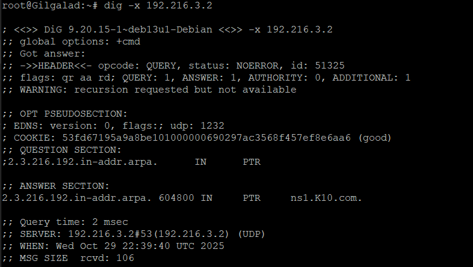

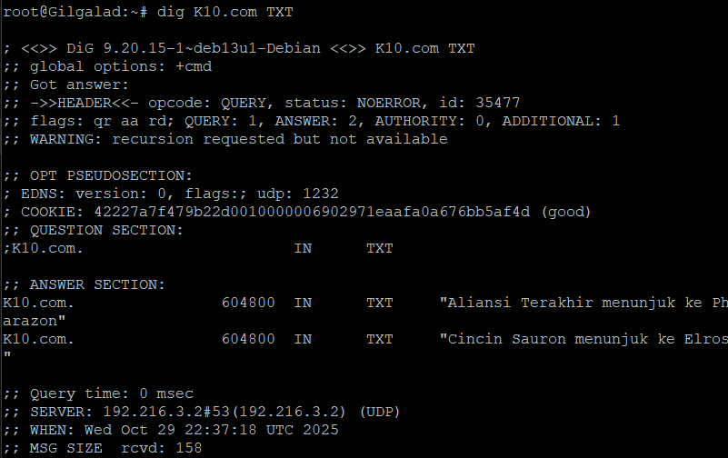

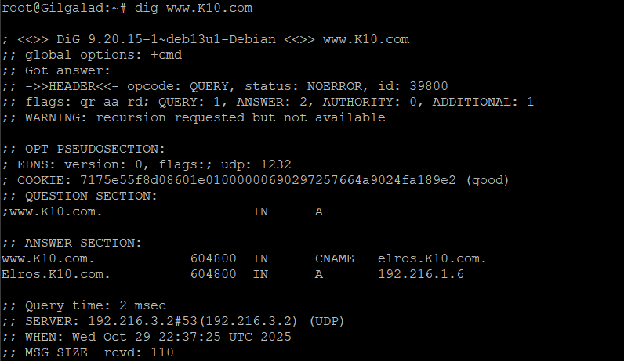

### Nomor 6
Soal:
Aldarion menetapkan aturan waktu peminjaman tanah. Ia mengatur:
- Client Dinamis Keluarga Manusia dapat meminjam tanah selama setengah jam.
- Client Dinamis Keluarga Peri hanya seperenam jam.
- Batas waktu maksimal peminjaman untuk semua adalah satu jam.

Penjelasan: Soal ini sudah dikerjakan bersamaan dengan Soal 2. Kita hanya perlu memastikan bahwa konfigurasi `dhcpd.conf` di `Aldarion` sudah mencakup lease time yang benar.

Konfigurasi di `Aldarion` (`/etc/dhcp/dhcpd.conf`):
```sh
# Atur max-lease-time global (Soal 6)
max-lease-time 3600; # 1 jam

# --- Subnet 1: Keluarga Manusia (untuk Amandil) ---
subnet 192.216.1.0 netmask 255.255.255.0 {
    ...
    # Lease time Manusia: 1/2 jam (Soal 6)
    default-lease-time 1800; 
}

# --- Subnet 2: Keluarga Peri (untuk Gilgalad) ---
subnet 192.216.2.0 netmask 255.255.255.0 {
    ...
    # Lease time Peri: 1/6 jam (Soal 6)
    default-lease-time 600;
}
```

Verifikasi:

- Di server `Aldarion`, jalankan `cat /var/lib/dhcp/dhcpd.leases`.

- Periksa blok lease untuk `Amandil` (selisih `starts` dan `ends` harus 1800 detik) dan `Gilgalad` (selisih 600 detik).

Hasil
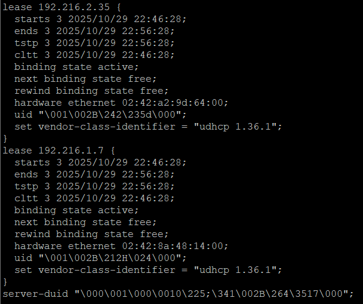

### Nomor 7
Soal:
Para Ksatria Númenor (Elendil, Isildur, Anarion) mulai membangun benteng pertahanan digital mereka menggunakan teknologi Laravel. Instal semua tools yang dibutuhkan (php8.4, composer, nginx) dan dapatkan cetak biru benteng dari Resource-laravel di setiap node worker Laravel. Cek dengan lynx di client.

Penjelasan: Kita harus menginstal semua dependensi di ketiga worker (`Elendil`, `Isildur`, `Anarion`). Karena mereka node statis dan firewall Soal 3 aktif, kita harus memperbaiki koneksi internet mereka terlebih dahulu (perbaiki DNS & paksa IPv4). Kita juga harus menggunakan `composer update` (bukan `install`) untuk mengatasi ketidakcocokan PHP 8.4 dengan `composer.lock` lama.

Skrip Instalasi (Jalankan di `Elendil`, `Isildur`, `Anarion`):

```sh
cat <<EOF > /etc/resolv.conf
nameserver 192.216.3.2
nameserver 192.216.3.3
nameserver 192.168.122.1
EOF

echo 'Acquire::ForceIPv4 "true";' | tee /etc/apt/apt.conf.d/99force-ipv4

echo "Langkah 2: Instalasi Nginx, Git, dan PHP 8.4..."
apt-get update
apt-get install -y nginx git php8.4-fpm php8.4-cli php8.4-mysql php8.4-xml php8.4-mbstring php8.4-curl php8.4-zip

apt-get install -y curl unzip
curl -sS https://getcomposer.org/installer | php -- --install-dir=/usr/local/bin --filename=composer

rm -rf /var/www/laravel-simple-rest-api
mkdir -p /var/www/

git clone https://github.com/elshiraphine/laravel-simple-rest-api.git /var/www/laravel-simple-rest-api

cd /var/www/laravel-simple-rest-api

composer update --no-dev

cp .env.example .env

cat > .env << EOF
APP_NAME=Laravel
APP_ENV=local
APP_KEY=
APP_DEBUG=true
APP_URL=http://localhost

DB_CONNECTION=mysql
DB_HOST=192.216.4.3
DB_PORT=3306
DB_DATABASE=laravel_db
DB_USERNAME=laravel_user
DB_PASSWORD=password123
EOF

php artisan key:generate
```

Hasil
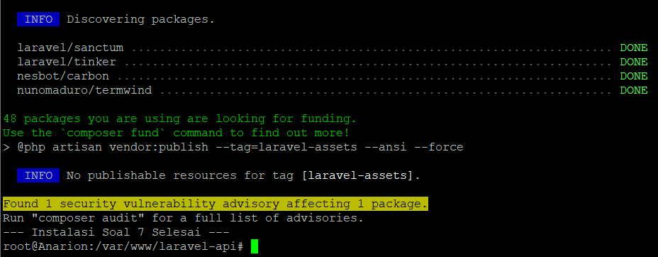

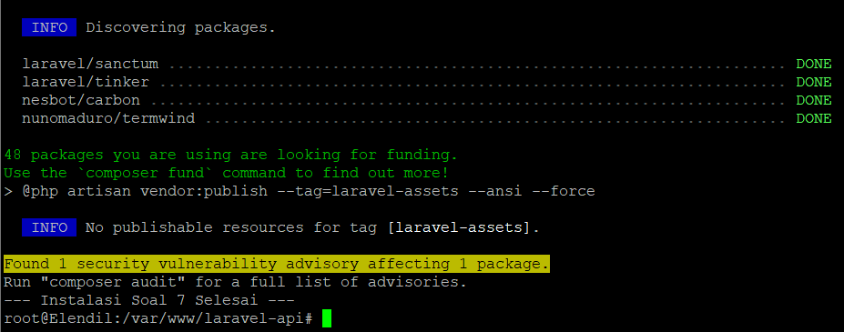

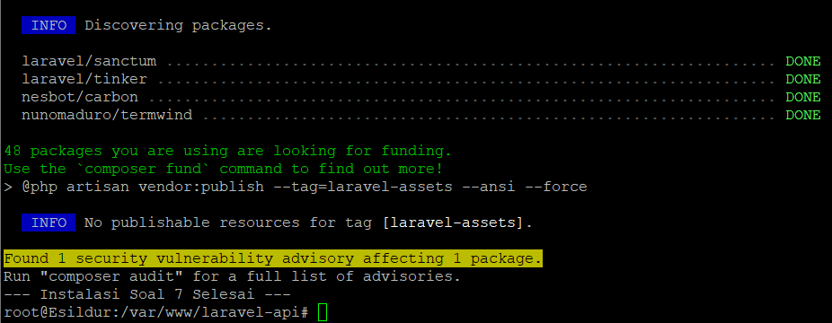

### Nomor 8
Soal:
Setiap benteng Númenor harus terhubung ke sumber pengetahuan, Palantir. Konfigurasikan koneksi database di file .env masing-masing worker. Setiap benteng juga harus memiliki gerbang masuk yang unik; atur nginx agar Elendil mendengarkan di port 8001, Isildur di 8002, dan Anarion di 8003. Jangan lupa jalankan migrasi dan seeding awal dari Elendil. Buat agar akses web hanya bisa melalui domain nama, tidak bisa melalui ip.

Penjelasan: Ini adalah skrip 4 bagian: (1) Siapkan database di `Palantir` (termasuk perbaikan DNS/IPv4 dan error `Access denied`). (2) Perbarui firewall `Durin` agar mengizinkan koneksi ke port 3306. (3) Konfigurasi `.env` dan Nginx di setiap worker (termasuk perbaikan permission `HTTP 500`). (4) Jalankan migrasi hanya di `Elendil`.

Jalankan di `Palantir` (Database Server):
```sh
echo "Langkah 1: Memperbaiki DNS & IPv4..."
cat <<EOF > /etc/resolv.conf
nameserver 192.216.3.2
nameserver 192.216.3.3
EOF
echo 'Acquire::ForceIPv4 "true";' | tee /etc/apt/apt.conf.d/99force-ipv4

echo "Langkah 2: Menginstal MariaDB Server..."
apt-get update
apt-get install -y mariadb-server

echo "Langkah 3: Mengkonfigurasi bind-address..."
sed -i "s/bind-address\s*=\s*127.0.0.1/bind-address = 0.0.0.0/" /etc/mysql/mariadb.conf.d/50-server.cnf
service mariadb restart

echo "Langkah 4: Membuat database dan user (Perbaikan 'Nuke & Recreate')..."
mysql -u root <<MYSQL_SCRIPT
DROP USER IF EXISTS 'laravel_user'@'%';
CREATE DATABASE IF NOT EXISTS laravel_db;
CREATE USER 'laravel_user'@'%' IDENTIFIED BY 'password123';
GRANT ALL PRIVILEGES ON laravel_db.* TO 'laravel_user'@'%';
FLUSH PRIVILEGES;
MYSQL_SCRIPT
```

Jalankan di `Elendil`, `Isildur`, `Anarion` (Template Worker):

Contoh script dibawah adalah untuk `Elendil`, untuk `Isildur (PORT 8002)` dan `Anarion (PORT 8003)` bisa disesuaikan lagi.

```sh
cat <<EOF > /etc/nginx/sites-available/elendil.K10.com
server {
    listen 8001;
    server_name elendil.K10.com elros.K10.com;
    root /var/www/laravel-simple-rest-api/public;
    index index.php;
    location / { try_files \$uri \$uri/ /index.php?\$query_string; }
    location ~ \.php\$ {
        include snippets/fastcgi-php.conf;
        fastcgi_pass unix:/var/run/php/php8.4-fpm.sock;
    }
    location ~ /\.ht { deny all; }
    error_log /var/log/nginx/laravel_error.log;
    access_log /var/log/nginx/laravel_access.log;
}
EOF

rm -f /etc/nginx/sites-enabled/default
rm -f /etc/nginx/sites-enabled/elendil.K10.com
ln -s /etc/nginx/sites-available/elendil.K10.com /etc/nginx/sites-enabled/

chown -R www-data:www-data /var/www/laravel-simple-rest-api/storage
chown -R www-data:www-data /var/www/laravel-simple-rest-api/bootstrap/cache

service php8.4-fpm restart
service nginx restart
```

Hasil
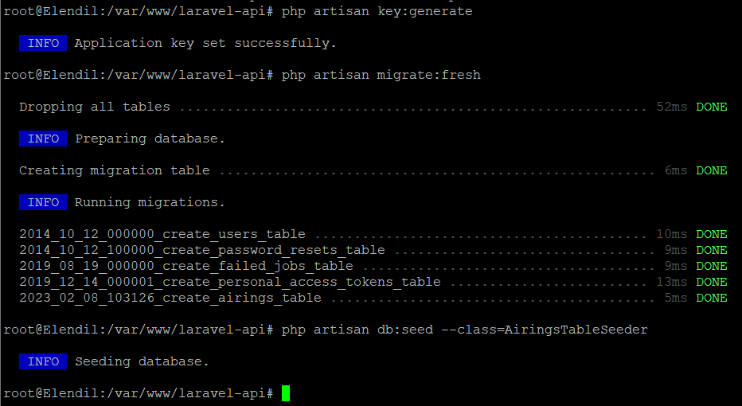

### Nomor 9
Soal:
Pastikan setiap benteng berfungsi secara mandiri. Dari dalam node client masing-masing, gunakan lynx untuk melihat halaman utama Laravel dan curl /api/airing untuk memastikan mereka bisa mengambil data dari Palantir.

Penjelasan: Kita akan menguji dari client (misal `Amandil`) untuk memastikan Nginx (`lynx`) dan koneksi Database (`curl`) di setiap worker berfungsi.

- Tes koneksi ke Elendil, Isildur, Anarion
```sh
lynx http://elendil.K10.com:8001

lynx http://isildur.K10.com:8002

lynx http://anarion.K10.com:8003
```

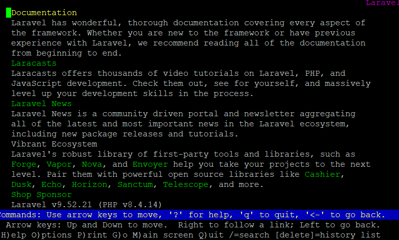

- Tes API
```sh
curl http://elendil.K10.com:8001/api/airing

curl http://isildur.K10.com:8002/api/airing

curl http://anarion.K10.com:8003/api/airing
```

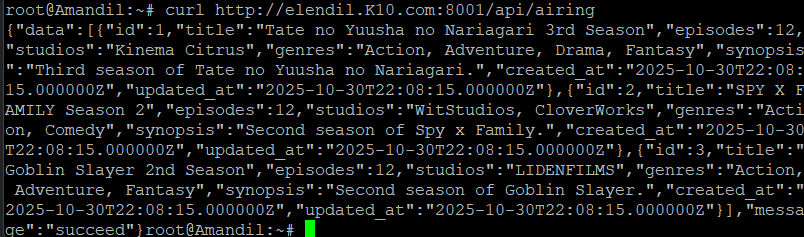

### Nomor 10
Soal:
Pemimpin bijak Elros ditugaskan untuk mengkoordinasikan pertahanan Númenor. Konfigurasikan nginx di Elros untuk bertindak sebagai reverse proxy. Buat upstream bernama kesatria_numenor yang berisi alamat ketiga worker (Elendil, Isildur, Anarion). Atur agar semua permintaan yang datang ke domain elros.<xxxx>.com diteruskan secara merata menggunakan algoritma Round Robin ke backend.

Penjelasan: Kita akan menginstal Nginx di `Elros` (`192.216.1.6`) dan mengkonfigurasinya sebagai load balancer. Algoritma Round Robin sudah default, jadi kita hanya perlu mendefinisikan `upstream` dan `proxy_pass`. Kita juga harus memperbaiki Nginx di worker (langkah `sed`) agar mau menerima traffic dari `elros.K10.com`.

Setup Elros:
```sh
cat <<EOF > /etc/nginx/sites-available/elros.K10.com

log_format upstream_custom '\$remote_addr - \$remote_user [\$time_local] '
                             '"\$request" \$status \$body_bytes_sent '
                             '"\$http_referer" "\$http_user_agent" '
                             'upstream="\$upstream_addr"';

upstream kesatria_numenor {
    server 192.216.1.2:8001;  # Elendil
    server 192.216.1.3:8002;  # Isildur
    server 192.216.1.4:8003;  # Anarion
}

server {
    listen 80;
    server_name elros.K10.com;

    access_log /var/log/nginx/elros_access.log upstream_custom;
    error_log /var/log/nginx/elros_error.log;

    location / {
        proxy_pass http://kesatria_numenor;
        proxy_set_header Host \$host;
        proxy_set_header X-Real-IP \$remote_addr;
        proxy_set_header X-Forwarded-For \$proxy_add_x_forwarded_for;
        
        proxy_http_version 1.1;
        proxy_set_header Connection "";
    }
}
EOF
```

Verifikasi:

Di `Amandil`, kirim 12 request:
`for i in {1..12}; do curl -s -o /dev/null http://elros.K10.com/api/airing; done`

Cek di Elros
`cat /var/log/nginx/elros_access.log`

Hasil
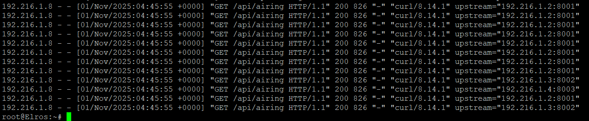
